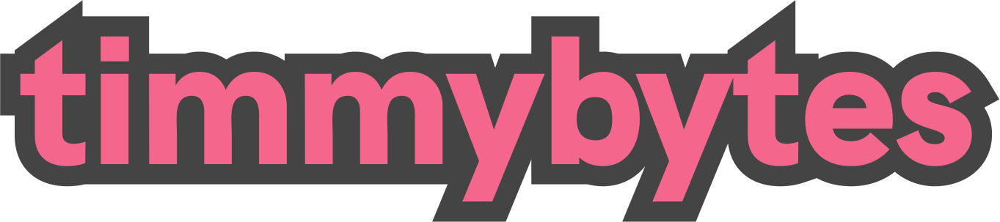

<h1 align="center">
  
</h1>

<div align="center">
  
  
  
  
</div>

<div align="center">
  <strong>A dev portfolio-blog</strong>
</div>

<p align="center">
  <sub>Built with ❤︎ by (and for) Timothy Merritt
</div>

This is my personal portfolio and blog site, built with React/Next.js, SCSS/styled-components, React-Icons, and deployed through Vercel. This project (will soon) replace my original portfolio website built primarily with vanilla HTML/SCSS/JS. This new site will allow for more scalable logic, a component-based frontend, and a more pleasing UI (dark mode coming soon!).

## For local development

1. [Fork a copy](https://github.com/timmybytes/timmybytes-blog/fork)
2. Clone locally:

   ```sh
   git clone https://github.com/your-user-name/timmybytes-blog.git
   ```

3. Install dependencies:

   ```sh
   cd timmybytes-blog/
   npm install
   ```

4. Start development server on <http://localhost:3000> (default):

   ```sh
   npm run dev
   ```

## Dependencies

The `timmybytes` blog uses the following libraries:

* Next.js/React
* React Icons
* Styled Components
* SASS
* Testing Library, Jest, and `jest-axe` for testing

## License

**timmybytes** name, logo, and written site content &copy; Timothy Merritt, all rights reserved. All site code design offered under MIT license, except where under existing license.

## Contributing

I'm not currently looking for contributors to this project, as it's intended to be a fully self-built site. However, if you'd like to request a feature (especially around accessibility!!) or report an issue, please do!
